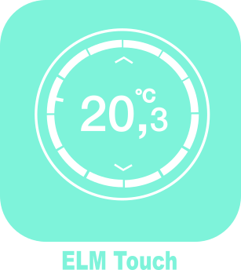

# Jeedom plugin for ELM Touch (alias Nefit easy, alias Worcester Wave) boiler Controller

This is a plugin for the Jeedom (https://www.jeedom.com) open source (https://github.com/jeedom) home automation system.

It allow to control the ELM Touch smart boiler controller from your Jeedom system.

The ELM Touch controller is made by Bosch and sold in different countries under various names :

* Nefit Easy (Netherlands)
* Junkers Control CT100 (Belgium)
* Buderus Logamatic TC100 (Belgium)
* E.L.M. Touch (France)
* Worcester Wave (UK)
* Bosch Control CT‑100 (Other)

This plugin was previously using the nefit-easy-http-server library made by Robert Klep https://github.com/robertklep/nefit-easy-http-server to communicate with Bosch servers.
It now uses the more recent Bosch-XMPP library made by Robert Klep https://github.com/robertklep/bosch-xmpp.

ELm touch, ELM Leblanc, Nefit Easy, Junkers, Buderus, Worcester Wave and Bosch are trade marks of the Bosch group.
