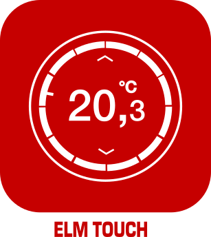

# Jeedom plugin for ELM Touch (alias Nefit easy, alias Worcester Wave) boiler Controller

This is a plugin for the Jeedom (https://www.jeedom.com) open source (https://github.com/jeedom) domotic system.

It will permit to control the ELM Touch smart boiler controller from your Jeedom.

The ELM Touch controller is made by Bosch and sold in different countries under various names :

* Nefit Easy (Netherlands)
* Junkers Control CT100 (Belgium)
* Buderus Logamatic TC100 (Belgium)
* E.L.M. Touch (France)
* Worcester Wave (UK)
* Bosch Control CT‑100 (Other)

This plugin use the nefit-client-python library made by Patrick van der Leer https://github.com/patvdleer/nefit-client-python to communicate with Bosch servers.

ELm touch, ELM Leblanc, Nefit Easy, Junkers, Buderus, Worcester Wave and Bosch are trade marks of the Bosch group.

BIG WARNING : This is a work in progress and not finished. I just committed it to Github to keep a state of my project do not use until further notice. You have been warned.